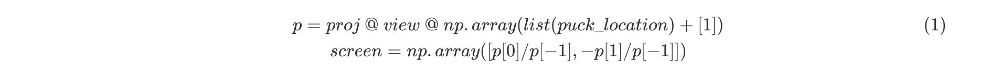
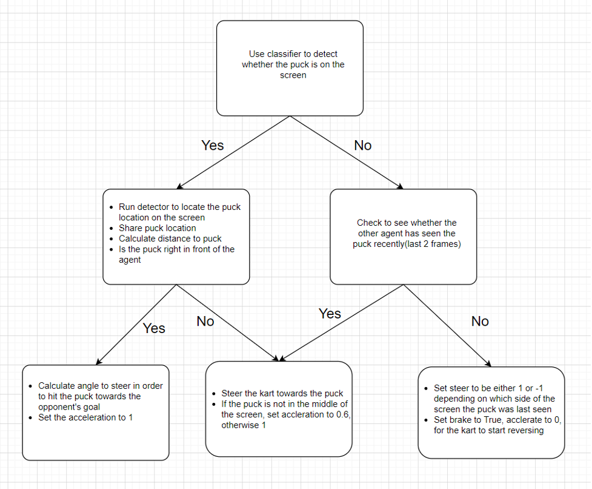

# SuperTuxKart Ice Hockey Final Report
####  Team Members: Weihan He(wh7458), Chase Van De Geijn(cmv984), Peng Wang(pw7977), Alexander Martin (arm3849)

## 1. Introduction

The goal for our final project was to create a SuperTuxKart ice-hockey agent that would win a two-on-two hockey game against the game AI as well as agents created by other teams. The agent would only have access to its kart information, meaning it only had a frontal image to determine the location of the ball. We used a modified version of a racing simulator built on SuperTuxKart for the gameplay, which will be used to compete in a hockey tournament with two of our agents competing against our classmates’ agents.

Each game is played until three goals have been scored or for a maximum of 1200 steps (2 minutes at 10 steps/min). The winner of the game is the team with more goals, and the winner of the tournament is the team with the most victories with goal differential acting as a tiebreaker. 

This final project writeup will include an overview of our approach, different strategies we considered, and challenges that we encountered as we tried to improve our performance. In particular, we cover collecting the data, training the model, improving the controller, and areas of improvement.

Fig.1 (above): Our agent chases the puck during gameplay, navigates toward the opponent’s goal, and scores with a successful double offense strategy
 

## 2. Collecting the Data
### 2.1 Methodology

To get started, we designed a simple controller to collect data. We were provided with a built-in AI agent that we were trying to beat. Initially, we used this AI and let them play the game against each other to collect labeled data; however, we found that this method led to deterministic examples. This caused gaps in the kinds of examples our networks had seen. To fix this, we modified the AI to have some randomness in its controls, every 20 frames the agent’s steer is set to random(-1,1). We ran four of these agents for 5,000 steps saving each step as a 400x300 pixel frame resulting in a 20,000 frame dataset.

For each frame, we projected the puck 3D location to the current player’s camera view using the function,

If the projection of the puck was on the kart’s screen, we saved it to a folder containing the examples that were on screen along with the screen coordinate of the puck. If the coordinate was not on screen, then we saved it to a separate folder containing examples where the puck was not on screen.

If the projection of the puck was on the kart’s screen, we saved it to a folder containing the examples that were on screen along with the screen coordinate of the puck. If the coordinate was not on screen, then we saved it to a separate folder containing examples where the puck was not on screen.

### 2.2 Issues encountered

In our initial data collections, we had issues with a high volume of images where the ball appeared to not be on the screen despite the location of the ball showing up in the range [-1, 1]. This error occurred when the puck is behind the camera, p[-1] < 0; therefore, we were able to eliminate the false positives in our training dataset by enforcing that only when p[-1] > 0, the puck can be on screen.

The other problem we encountered during data collection is when the puck is at the edge of the screen, where its center is off screen but half of it is still clearly visible. We considered expanding the range [-1,1] to [-1.1,1.1] in order to handle those edge cases; however, this strategy fails when the pucks are sufficiently far.

After improving our data collection method, we generated 20,000 examples (consisting of a mix of positive and negative examples) and used them as our training data for both the classifier and detector. We also generated a validation dataset of 8,000 examples.

Later in the project, we had difficulty testing in a timely fashion because the resolution of the frames was too high. This meant long waits when generating the data, transferring it to collab, and loading it into a dataloader. If we had to go back and redo the project, we would decrease the resolution of the images we generated for testing and designing the neural networks and train a higher resolution only for a final result.

## 3. Detector / Classifier Models

### 3.1 Methodology

Our strategy was to create two neural networks: one for determining whether the puck is on screen, the other for determining its location if it is on screen. The network that was trained to recognize if the ball is on screen, the classifier, consisted of two parts: a convolutional section, and a linear section. The network for determining the location on screen consisted of a down-convolution section, encoder, and up-convolution section, decoder.

The classifier contained four blocks. Each block consisted of a down-sample (stride>1) convolutional layer, two neutral (stride = 1) convolutional layers, and batch norms between each layer. There is an additional skip connection in each block. The classifier the number of channels output channels of these four blocks were in order 16, 32, 64, 128. These blocks are followed by a linear section. The results of the linear section are two output channels, a logit for 0 and 1. The greater of the two logits is the result for whether the network thought the image contained the puck.

The label for the training data was determined by the folder the image came from. The image was labeled as 1 if it came from the folder with a puck, and 0 if it came from the folder without one.We used CrossEntropyLoss as our loss function and trained for 100 epochs with a learning rate of 5e-5. The reason the learning rate was so low is because we were having difficulty training with higher ones. We hypothesize that we were experiencing a large initial gradient leading to a vanishing gradient. If the output got large enough, the sigmoid of the logit would round to 1.0. This is a problem since the gradient of a sigmoid gets infinitely close to 0 as the sigmoid gets infinitely close to 1. This is also why we produced two logits with softmax instead of one with sigmoid. Because the way floats are stored, the computer is less likely to round to 0 than it is to round to 1. The hope was that even if the softmax rounded one of the outputs to 1.0, the other would not be rounded to 0. The drawback, however, is slower training and twice as many parameters and operations in the linear layer.

The detector consisted of four down-convolution blocks and four up-convolution blocks. The down-convolution blocks are the same as the classifier and the up-convolution blocks are the up convolutional analog of those blocks. The last up-convolution block produces a form of heatmap. The index of the highest value of the heatmap is returned as the screen coordinate of the puck. The detector had an additional output which was intended to estimate the distance to the puck, however we decided to create a separate network for the distance and eventually scrapped the idea.

Although we continued to encounter challenges with the classifier. Though the classifier had a 95% accuracy on the training set, it had 70 false positives and 70 false negatives out of 1000 frames while simulating our agent. Many of these frames could be explained by not having many training examples in that area of the environment. These could be fixed by augmenting the training data with the errors and further training, but we were not able to fix them given our time constraints.

The biggest limitation we ran into was the physical time it took to train the models. Since our image sizes were so very large, 400x300, it took roughly four hours to retrain the detector, while the CNN classifier took ten hours to train on Google Colab on a V100 card.

### 3.2 Things we tried

We had trained a model with the same structure as the detector for estimating the distance puck. However, the distance detector did not make it into our final player. We found that, though the model performed reasonable, we were better off estimating the distance using computer vision tricks than deep learning.

In an effort to mitigate the slow training process, we tried resizing the images to 128x128, thus making the process significantly faster for our next batch of training. After getting through the slower first few epochs, the training time was improved, but our predictions were less accurate.This would have been good for initial testing, but by this point we were in crunch time and already had a functioning model.

We tried using a non-lazy dataloader for both the detector and classifier, however this didn’t work for high numbers of images. We had to switch the dataloading to a lazy method for the classifier because it had twice as many examples.

We also tried to implement a residual network, but found that it overfit the training examples. The residual network followed the design of ResNet-18. Each residual block consists of 2 convolutional layers where the first convolutional layer has a stride > 1 and the second layer has a stride = 1. The kernel size of these 2 convolutional layers are set to be 3. Also, batch-normalization layers were inserted after each convolutional layer. Finally we add another downsampling convolutional layer to form the residual connection. The residual network consists of 4 residual blocks, with output channel (i.e. number of kernels) set to be 16, 32, 64, 128, respectively. After these 4 blocks, we add an average pooling layer with kernel size of 4 to shrink the feature map. Finally, we add 2 linear layers with relu and dropout to form an output of 2 channels, a logit for 0 and 1. The greater of the two logits is the result for whether the network thought the image contained the puck. Since the input image generated from pystk has a resolution of 400 * 300 which is too large, we tried two ways 2 shrink it. One is directly resize it into 128 * 128 during dataloader procedure, the other is adding a convolutional layer before the residual blocks with kernel size of 7 and stride of 4. The network was trained using CrossEntropy loss on 1 RTX 2080ti card for 100 epochs. We set the starting learning rate to be 1e-4 and adopted a learning rate scheduler which halved the learning rate at epoch 25, 50 and 75, respectively. Although the results show that this kind of deep version of residual network can reach an accuracy of 0.96 on train set and 0.92 on test set, we found that actually it turned out to overfit the training examples. This indicates that actually we don’t need this kind of deep version of the residual network for this binary classification problem. Therefore, we finally choose the network structure described in the previous section.

Though we had set up a validation set for testing, we found accuracy didn’t tell the whole story. Instead, we displayed the networks predictions in a video of an agent playing (as shown in  Fig. 1). This helped us understand what kind of mistakes the network makes.

## 4. Enhancing the Controller

### 4.1 Methodology

Initially, our controller was designed to simply utilize the output of our classifier and detector and follow the puck if it is visible, or reverse while turning to look for the puck otherwise. This way we were able to choose the best models and evaluate their performance. 

Once we were satisfied with our best models, multiple methods were implemented in order for our agent to score.

**Two utility functions:**

* `world_to_screen()`: project world coordinate to screen coordinate. We used this to map opponent goal to our agent’s screen as well as puck location shared by the our other agent

* `to_world()`: estimate world coordinate given the screen coordinate. This is done by calculation the intersection of ray, from a point on the screen, and the ground. We use this to estimate the puck world coordinate, both to calculate distance to puck as well as sharing the coordinate with our other agent

**Main strategy:**

### 4.2 Things we tried

There are many hyper parameters (ex. magnitude of the steer, acceleration amount, …) that could be tuned. One idea we had to tune them was a variant on a genetic algorithm. We quickly realized that it took too long to simulate each game for this to be a viable method. Perhaps this could have worked given more time. 

## 5. Tradeoffs Between Offensive and Defensive Focus

We discussed experimenting with three different strategies consisting of an offensive-minded approach, a balanced approach, and a defensive-minded approach. The first strategy would consist of double offense with both agents aggressively attacking the opponent goal in tandem to try to score the puck. The second strategy would consist of one agent attempting to score and the other agent staying back to defend our team’s goal. And the third strategy would consist of double defense with both agents staying back to defend our goal, but we decided not to pursue this approach because the objective of the game is to ultimately score at least one goal per match, and having two defenders without offense is an infeasible method of scoring. 

For the balanced approach, our discussions centered around having one agent focused on offense and the other agent focused on defense, which we thought could be a successful strategy since in theory the defender is always behind the ball, and if the defender attacks the ball, it could hit the puck toward the opponent’s goal so that our offensive player would have an easier path to scoring. This type of teamwork between agents could work well if the defender stops an opposing agent from scoring by sitting at the goal, hitting the puck when it is close to start our team’s attack, and then going back to the goal to be in position if the other team attacks our goal again.

Ultimately, however, we focused on implementing a double offense strategy. Given the time constraints, we believed that our double offense approach would maximize our team’s chances of winning both from an absolute and a relative perspective: We thought we could average more total goals with double offense, and our goal differential against other teams would hopefully be optimized by having our two offensive karts work together. We believed that having a defender stay back to protect our side would not save as many goals as having an extra attacking agent would generate for our offense, and we wanted to minimize the probability of [0, 0] games. But we also did not get to test this theory because our main priority was to develop an agent that could score; in a world without time constraints, I think we would have liked to experiment further with developing a defensive agent that would optimize for goal prevention.

## 6. Areas of Future Improvement

The only method to improve puck tracking would be to keep a shared history of puck world coordinate estimations, and actively update it each frame, while filtering out unrealistic/false estimations where the puck is too far from the previous puck position. If this were to be implemented, we could implement more advanced scoring strategies since there is more reliable puck location estimation.

Increasing our shot quality would also prove useful, as we were able to take many shots on goal but had room for improvement in the accuracy category (shots attempted / shots made). For better shot quality, we could try to make tweaks to the angles of our shots and position our agents to adjust their positions so as to align their projected shot path with the goal—even better would be to angle such that the projected shot path was on the side of the goal furthest away from the goal defender (goalkeeper) to maximize our likelihood of scoring. Having a more sophisticated projection model and angle for targeting the goal while avoiding defenders trying to block the puck would increase the quality of shots we take on goal, thereby boosting our offensive efficiency and our likelihood of scoring. 

Finally, we believe that with additional time, we could create a more sophisticated model that integrates both our puck recognition model (with depth estimation) and imitation learning from an expert player, thereby strengthening our agent gameplay. By imitating an expert playing the game for 10 minutes, we could perhaps optimize a balanced offense/defense and develop an agent to take higher-quality shots on goal with precise launch angles while our other agent stays back to protect our goal and prevent the other team from scoring. For this project, we could not figure out how to hook up an actual player to the game with the API given, but imitating an expert player as opposed to an AI could have significantly improved our performance, given that an AI typically has more information than we are given, while a player generally has less information since all we see is a single image during gameplay. It would also be interesting to learn more about the relationship between vision learning and imitation learning in the realm of self-driving cars and consider ways in which we could apply those techniques to design agents to compete with Esports pros.